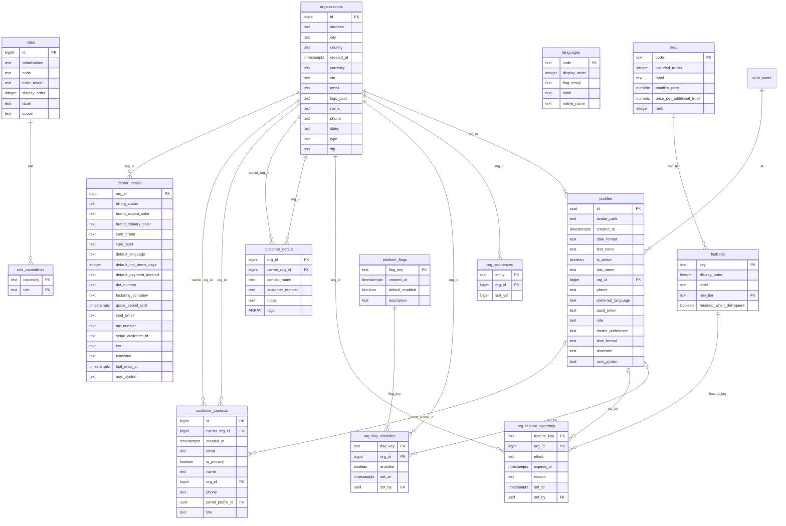
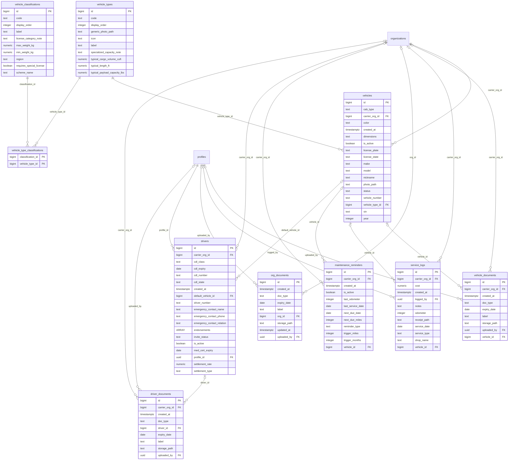
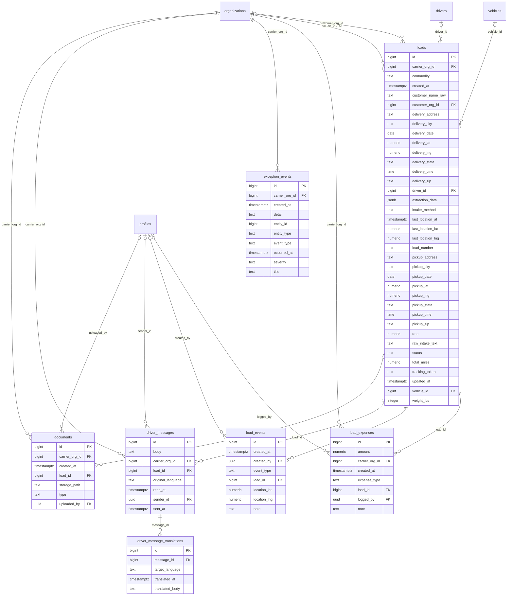
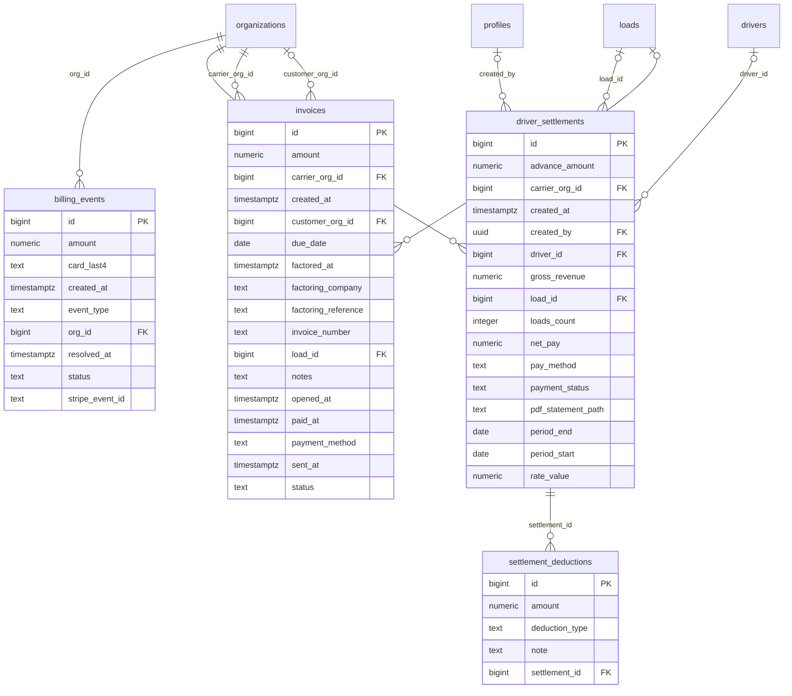
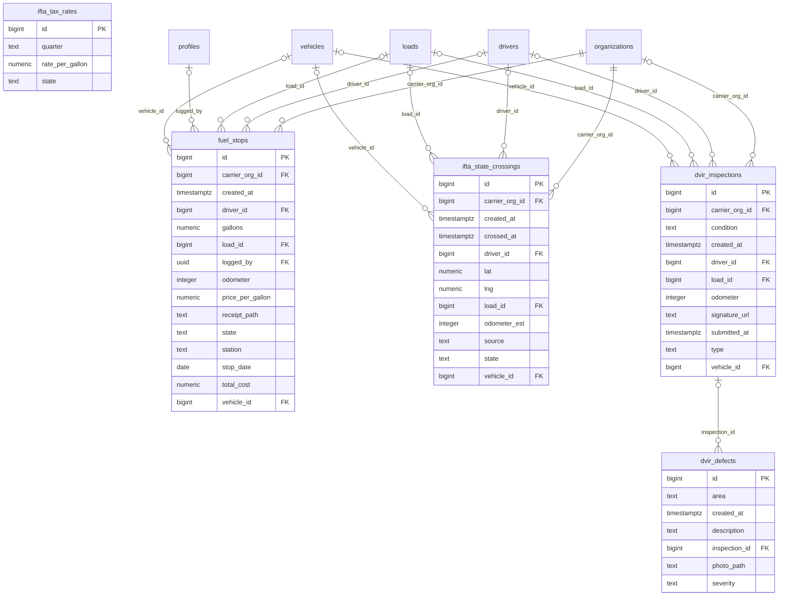
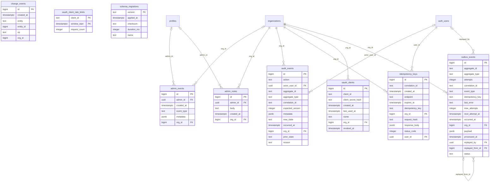

# CarrierOS entity-relationship diagrams

> **Generated** by `node scripts/db/gen-erd.mjs` from the live schema. Do not edit by hand:
> change the database via a migration, then re-run the generator. CI runs it with `--check`.

49 tables, 89 foreign keys, split into 6 domain diagrams (one diagram of every table is unreadable).
A box drawn without columns belongs to another domain; find it in its own section.
`||` = the FK is required (NOT NULL); `|o` = the FK is optional (nullable). `PK`/`FK` mark keys.

Conventions worth knowing: every tenant-owned row carries `carrier_org_id` or `org_id` and is isolated by
row-level security; vocabularies are `TEXT` + `CHECK`, not Postgres enums (so generated types are plain
`string`); the loads_driver_view view (loads without `rate`) is not a table and is not drawn.

## Tenancy, identity & entitlements

Organizations (carrier / customer / platform), their users, roles and the tier/feature model that gates what each org may use.

Tables: `organizations`, `carrier_details`, `customer_details`, `customer_contacts`, `profiles`, `roles`, `languages`, `role_capabilities`, `tiers`, `features`, `org_sequences`, `org_flag_overrides`, `org_feature_overrides`, `platform_flags`

## Fleet

Vehicles, drivers, their documents, and maintenance.

Tables: `vehicles`, `vehicle_types`, `vehicle_classifications`, `vehicle_type_classifications`, `vehicle_documents`, `drivers`, `driver_documents`, `org_documents`, `maintenance_reminders`, `service_logs`

## Loads & dispatch

The core shipment record, its timeline, expenses, documents (POD etc.), exceptions and driver chat.

Tables: `loads`, `load_events`, `load_expenses`, `documents`, `exception_events`, `driver_messages`, `driver_message_translations`

## Billing & settlements

Customer invoices, driver settlements and their deductions, and subscription billing events.

Tables: `invoices`, `driver_settlements`, `settlement_deductions`, `billing_events`

## Compliance & IFTA

Fuel purchases and state crossings for IFTA reporting, and driver vehicle inspection reports (DVIR).

Tables: `fuel_stops`, `ifta_state_crossings`, `ifta_tax_rates`, `dvir_inspections`, `dvir_defects`

## Platform & infrastructure

SuperAdmin activity, the tenant audit trail, transactional outbox, live-update change feed, idempotency keys, the public developer API's OAuth clients/rate limits, and migration bookkeeping.

Tables: `admin_events`, `admin_notes`, `audit_events`, `outbox_events`, `change_events`, `idempotency_keys`, `oauth_clients`, `oauth_client_rate_limits`, `schema_migrations`

