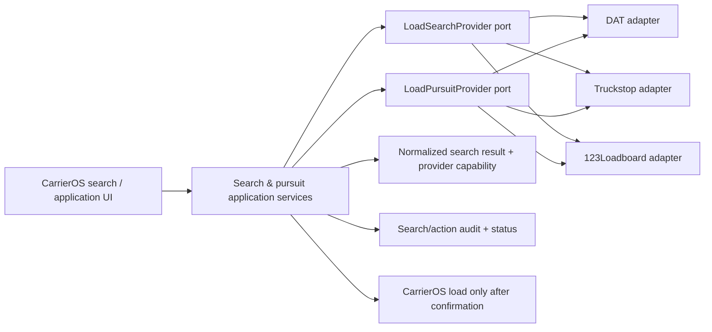

# CarrierOS Load Marketplace — Product Brief

**Status:** Discovery + design review (not implementation approval)  
**Audience:** Product, Design, Engineering, QA, Partnerships, DevSecOps  
**Updated:** 2026-09-30

## Product opportunity

Let a carrier find suitable freight, evaluate it, contact/apply/book where the board permits, and carry an awarded load into dispatch without repeatedly switching between CarrierOS and several board sites. This extends the existing load lifecycle: *source freight → win/accept → dispatch → execute → invoice*.

**Positioning hypothesis:** “Find and work your next load from your TMS.” Validate this with owner-operators and small carrier dispatchers before presenting it as a proven differentiator. Integrations do not automatically include or replace a DAT, Truckstop, or 123Loadboard subscription.

## Current state in CarrierOS

- A load-board category exists in Settings and the domain/application structure.
- `LoadboardPostingService` currently gates on `loadboard_posting` and requires an org credential.
- `MockDatClient` simulates **posting an existing CarrierOS load to DAT**. It does not connect to DAT, search available freight, apply/bid, or book.
- Current implementation is a seam, not a real provider integration. Its Growth+ code gate differs from the older PRD's Pro posting / Enterprise bi-directional wording; Product must reconcile tier placement before monetization or implementation.

## Primary users and jobs

| User | Job to be done | Key guardrail |
|---|---|---|
| Owner-operator / Solo | Find a profitable load matching my truck, lane, schedule, and operating costs; pursue it quickly | Fast mobile-responsive search; show gross vs. estimated net transparently |
| Dispatcher | Search across boards, compare options, contact broker, and convert awarded freight into dispatch work | Never create duplicate or booked loads from an unconfirmed application |
| Carrier owner | Connect/renew board accounts and choose which boards/seats the team may use | Explain required board subscription, user seat, and credential ownership |
| Finance | Review rate, costs, and awarded-load economics after booking | Finance does not need permission to make offers unless separately granted |
| Driver | View assigned/confirmed work | No access to broker bidding, account credentials, or carrier margin by default |

## Core use cases

1. **Connect a board:** owner/authorized admin chooses a provider, reviews prerequisites and supported actions, authorizes/configures an account, and sees connected / needs-attention / unavailable status.
2. **Search freight:** authorized owner/dispatcher sets origin + deadhead radius, optional destination + radius, pickup window, equipment, weight/length, minimum total rate or rate/mile, and selected boards. Results identify source board and last-updated time.
3. **Compare fit:** review total miles, deadhead, estimated loaded miles, rate/mile, pickup/delivery windows, equipment/commodity requirements, broker identity/available contact or safety information (only when provider permits), and the reason a result matches.
4. **Pursue freight:** user chooses the provider-supported action: contact/inquire, submit offer/bid, accept tender, instant book, or continue in provider site. Show the action and any terms before confirming; do not imply all boards support identical “Apply” behavior.
5. **Track application:** see submitted, waiting, countered, awarded/booked, declined, withdrawn, expired, and action-required states. Refresh or provider events update state without losing source IDs.
6. **Convert award to CarrierOS work:** on confirmed acceptance/book, create or link one CarrierOS load with provider reference, normalized lane/equipment/rate, provenance, and audit trail; let dispatcher assign driver/vehicle and continue the standard workflow.
7. **Demo mode:** deterministic sample results and simulated applications exercise the same UI and application ports, clearly marked **Demo data — no live board connection**. No mock result may be represented as live market inventory.

## MVP recommendation

### Experience scope

- Responsive web search for owners/dispatchers; prioritize desktop command-center ergonomics and ensure usable small-screen results for a solo carrier.
- Unified filter/result/detail experience with visible board provenance.
- Save search, refresh, shortlist, and application/booking activity list.
- One normalized search contract and provider-specific adapter per board. Preserve each board's native IDs, terms, action types, rate/counter state, timestamps, and source.
- Create a CarrierOS load only on confirmed award/booking (or a clearly labeled tender-pending workflow if partner API semantics require it).
- Deterministic demo adapter for design review, QA, and sales walkthroughs; explicit stale/mock labels.

### Do not assume for MVP

- A universal `apply` operation. A board can expose a message, bid, tender accept, instant book, or only provider-site handoff.
- One combined board subscription, one credential per carrier, or permission to cache/re-display every board field. Provider contracts and licenses decide these.
- Reposting/scraping board websites or using consumer browser automation when partner API access is unavailable.
- AI ranking as an opaque decision-maker. Initial “fit” should be explainable rules and configurable thresholds.
- Automated dispatch assignment, negotiation, or acceptance without a user-confirmed action.

## Provider strategy — US freight marketplaces

Priority below is a **CarrierOS integration recommendation**, not an independent market-share ranking. DAT describes its marketplace as the largest in North America and advertises 722,500 daily load postings; that is a vendor-reported posting metric, not a count of unique currently available loads. Public API documentation and actual partner access are different things: each provider must confirm endpoint access, commercial terms, permitted display/cache behavior, user-seat requirements, and certification.

| Rank | Provider | Why it is a candidate | Publicly evidenced API surface | Constraints / unknowns | Recommendation |
|---:|---|---|---|---|---|
| 1 | **DAT One** | Strongest first integration candidate for broad US truckload coverage; existing CarrierOS code seam already names DAT | DAT's official API page lists Load Board, Freight Posting, BookNow, and Tracking APIs; DAT advertises a very large marketplace | Developer Portal access is account-gated. Service-account/user and seat requirements vary by operation; production operations depend on product subscription and integration approval/certification. Need exact search/apply schemas, pricing, entitlements, caching rules, and TMS partner terms | Start partner discovery now; build only from approved docs/sandbox. MVP should prioritize carrier load search and the actually supported pursuit actions, not only posting |
| 2 | **Truckstop** | Major US marketplace with carrier load-search and adjacent data APIs | Official developer docs describe Load Search (SOAP/XML), load details, and search/detail operations; official integration page lists load posting, truck searching, rate data | Load Search is legacy SOAP-style; a separate REST Load Management search searches a customer's own posted loads, not marketplace freight. Load Board Pro, service credentials/Integration ID, partner enablement, signed agreement, and possible extra costs are called out | Pursue after or alongside DAT partner discussions if pilot customers use it; isolate SOAP transport in adapter |
| 3 | **123Loadboard** | API product explicitly describes load search plus messaging/bidding/booking capabilities that map closely to this workflow | Official API page lists Search Loads, Post Loads/Trucks, rate checks, messaging, bidding, and Book Now; partner receives a technical lead | Partner vetting required; detailed schemas, auth, rate limits, account plans and commercial terms are not public on landing page; verify during onboarding | Negotiate as a parallel candidate; it may offer a comparatively direct path to an end-to-end pursuit workflow if approved |

**Later / separate partnership lane:** Amazon Relay, Uber Freight, C.H. Robinson/Navisphere, RXO and similar closed shipper/broker networks may be valuable, but should not be described as generic public load boards. Validate each partner's integration program, carrier eligibility, and data rights after the first traditional board proves demand.

### Partner diligence checklist

For DAT, Truckstop, and 123Loadboard, request written answers and sandbox access for:

- CarrierOS/TMS partner approval, production certification, API product names, schemas, environments, support/SLA and version policy.
- Who owns authentication: CarrierOS service account, per-carrier account, or each end user's identity; OAuth/token refresh vs. API key/username/password; exact least-privilege scopes.
- Whether search, detail, contact, rate request, bid, booking, cancel, status and webhooks are enabled—and which require the carrier to have a specific paid seat/product.
- Whether a single CarrierOS screen may display board results, broker/contact/rate details; rules for caching, retention, derived ranking, attribution and user audit.
- Commercials: partner fees, per-org/per-seat licenses, customer pass-through subscription, transaction fees, minimums, and any exclusivity or data-use restrictions.
- Rate limits, pagination, freshness/expiry, retry semantics, idempotency keys, duplicate actions, booking races, and support escalation.

## Integration architecture

Use `LoadboardProvider`-specific adapters behind capability-oriented ports. Do not let the UI depend on DAT fields or force provider action differences into a fake uniform transaction.

Canonical result should preserve: provider + native posting ID, board `updated_at`/expiry, route/date/equipment/weight, source rate and rate basis/currency, broker/contact only if licensed, native action capabilities, and provider action reference. Keep account access tenant/user scoped, encrypt credentials at rest, never return secrets to the browser, respect board-specific search limits, and log user-confirmed external actions without exposing credentials. Define dedupe cautiously: merge visually only when provider data and terms permit, never discard source IDs or source attribution.

## Design/mockup review checklist

The companion [Mockup 28](../design/mockups/mockup-28-loadboard-marketplace.html) is an interactive prototype, not a claim about shipped features or exact provider APIs. Review these decisions:

- How should default equipment, home terminal, and deadhead preferences be sourced and overridden?
- Show gross rate and estimated empty/loaded miles; should we show estimated net after per-mile cost, and where does the carrier configure cost assumptions?
- What is the clearest difference among **Contact**, **Submit offer**, **Accept tender**, and **Book now**?
- Is a provider-site handoff acceptable where API terms prohibit native pursuit? If so, which parts still count as “one stop”?
- Can multiple board results be compared in one list under their licensing terms? What attribution must remain visible?
- Should integrations be per carrier organization, per dispatcher, or both? Who pays for upstream seats?
- When booking succeeds but CarrierOS load creation fails, what recoverable reconciliation state and operator message are required?

## Success measures and rollout gates

Track configured organizations by board, successful/failed search rate and latency, stale-result share, results-to-shortlist, shortlist-to-pursuit, pursuit-to-award/book, duplicate action prevention, booking-to-load conversion, and user-reported time saved. Establish baseline with a pilot before setting numeric targets. No live launch until provider terms, sandbox contract tests, secret handling, audit records, retry/race behavior, and support playbook are approved.

## Sources (official provider references, reviewed 2026-09-30)

- [DAT API Integration](https://www.dat.com/api-integration) · [DAT search-loads overview](https://www.dat.com/solutions/search-loads) · [DAT carrier plans](https://www.dat.com/carrier-load-board) · [DAT REST API / service-account FAQ](https://one.support.dat.com/9-troubleshooting-2734b01a/service-accounts-and-restful-api-faq-7c689bc5)
- [Truckstop API integrations](https://truckstop.com/product/integrations/) · [Truckstop developer Load Search](https://developer.truckstop.com/reference/load-search-soap) · [Truckstop API overview](https://developer.truckstop.com/reference/general-overview)
- [123Loadboard API](https://www.123loadboard.com/api/) · [123Loadboard partner program](https://www.123loadboard.com/about/partners/become-a-partner/)
- Existing outreach context: [`dat-loadboard-partner-outreach.md`](../dat-loadboard-partner-outreach.md)
